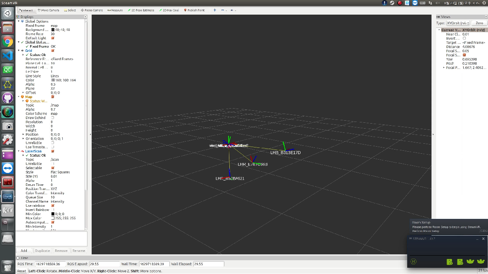

## HTC Vive Tracker Node for ROS


## PreRequirement

- Ubuntu 16.04 and more
- ROS Indigo and more

## 1. Install VulkanSDK (Ubuntu 16.04, ROS Kinetic)

```bash
# case of Ubuntu 16.04
$ sudo apt install libvulkan-dev

# case of Ubuntu 18.04
$ wget -qO - http://packages.lunarg.com/lunarg-signing-key-pub.asc | sudo apt-key add -
$ sudo wget -qO /etc/apt/sources.list.d/lunarg-vulkan-bionic.list http://packages.lunarg.com/vulkan/lunarg-vulkan-bionic.list
$ sudo apt update
$ sudo apt install vulkan-sdk
```

## 2. Install Steam

```bash
$ sudo apt-get install libsdl2-dev libudev-dev libssl-dev zlib1g-dev python-pip
$ sudo add-apt-repository multiverse
$ sudo apt install steam
$ sudo apt install steam-devices
```

1. Open Steam Program and log in with your Steam account
2. Enable the Steam Beta (Steam Menu → Settings → Account → Beta Participation)

## 3. Install Steam VR

1. Click Library
2. Click VR
3. Select SteamVR and Install it
4. Make a Symbolic Link from libudev.so.0 to libudev.so.1 for SteamVR to use.

    ```bash
    $ sudo ln -s /lib/x86_64-linux-gnu/libudev.so.1 /lib/x86_64-linux-gnu/libudev.so.0
    ```

## 4. Install pyopenvr

1. using pip command

```bash
$ pip install openvr==1.3.2201
```

2. using downloading source code and build and install openvr 1.3.2201

```bash
# Download tar.gz from https://github.com/cmbruns/pyopenvr/releases/tag/1.3.2201
$ cd Downloads
$ tar -xzf pyopenvr-1.3.2201.tar.gz
$ cd pyopenvr-1.3.2201
$ sudo python setup.py install
```

## 5. Set up SteamVR Options

1. Disable the headset requirement and enable a null (simulated) headset

```bash
$ gedit ~/.steam/steam/steamapps/common/SteamVR/resources/settings/default.vrsettings
```

- Change options
    - "requireHmd" : false
    - "forcedDriver": "null"
    - "activateMultipleDrivers" : true
2. Open default.vrsettings

```bash
$ gedit ~/.steam/steam/steamapps/common/SteamVR/drivers/null/resources/settings/default.vrsettings
```

- Change options
    - "enable" : true

## 6. Download and Build Vive Tracker ROS Node

```bash
$ cd ~/catkin_ws/src/
$ git clone https://github.com/moon-wreckers/vive_tracker.git
$ cd ~/catkin_ws
$ catkin_make
```

## 7. Ready for Setting Vive Trackers

1. Start SteamVR from the Steam Library (If you encounter `VRClientDLLNotFound`, make sure all of the dependencies are installed properly, especially VulkanSDK, and delete and recreate the symbolic link described above).
2. Turn on the tracker with its button, and make sure that its wireless USB dongle is plugged in to your computer. If the tracker shows up in the SteamVR overlay skip to step 4.
3. Sync the tracker. Hold the button on the tracker until the light blinks. On the SteamVR overlay click the "SteamVR" dropdown menu. Click Devices->Pair Controller. The Tracker should then pair with the computer, and a green outline of the tracker should appear on the SteamVR overlay. If this doesn't work try unplugging the wireless USB dongle, plugging it back in, and restarting SteamVR. Restarting your computer wouldn't hurt either.
4. Ensure the Lighthouse base stations are turned on, facing each other, have green lights showing on them Place the tracker in view of the Base Stations. The SteamVR overlay should now show two green square Base Stations and a solid green Tracker hexagon. The tracker is now working.
    1. If you're only using 1 Base Station, make sure it's set to mode A.
    2. If you're using 2 Base Stations without a sync cable, ensure they're set to modes B and C.
    3. If you're using 2 Base Stations with a sync cable, ensure they're set to modes A and B.

## 8. Run Vive Tracker ROS Node

```bash
$ roscore
$ roslaunch vive_tracker vive_tracker.launch
```

1. Now open another terminal and run `rostopic echo /vive/LHR_BD4ED973_odom` to view the x y z roll pitch yaw output from the tracker.
2. (Optional) Start RViz in another terminal with `rviz`
3. (Optional) In the lower left corner of RViz click on `Add`, and scroll down the Add menu to add a `TF`. If all went well you should now be able to see the tracker moving in RViz.
4. If for some reason it isn't working, check to ensure that the Tracker is turned on, SteamVR is still running, the tracker icon is green, and the vive_tracker ros node is still running.


